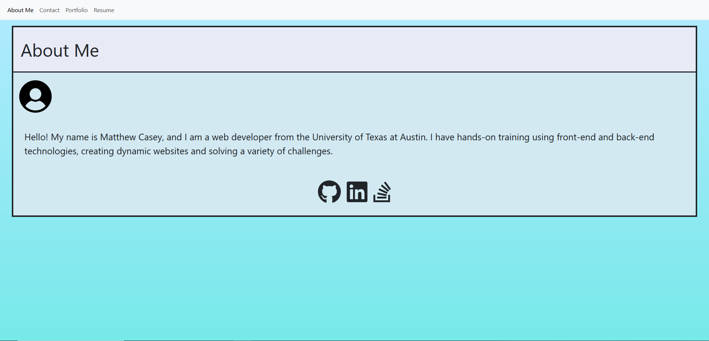
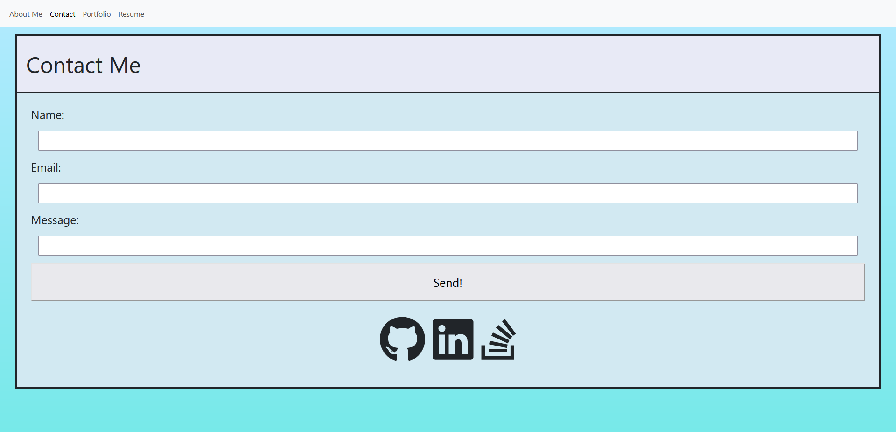
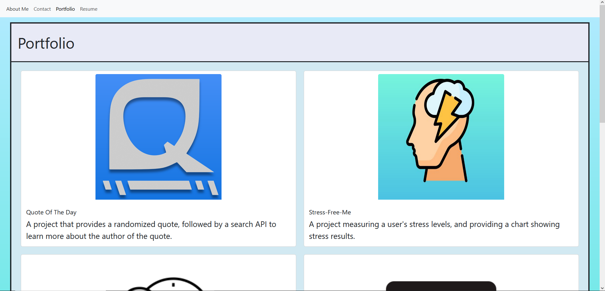
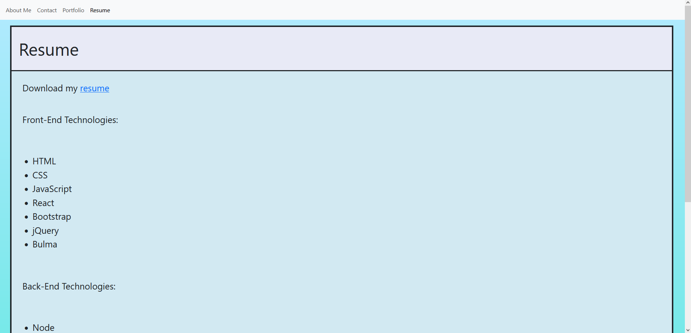

# Description

This is a project that practices utilizing React to create a portfolio. It was fun being able to learn how each component connect with each other, while also being easy to main a fast rendering site. However, the only issue that I came across was deployment using Netlify, since there's an issue with displaying images, as well as my resume. There's a reoccurring issue with Netlify using Vite with configuring a website.
This does help me understand that not everything is perfect when it comes to deployment, and it is a great experience for me to understand how normal this must be when deploying any kind of website with a team.

Link to Netlify Deployment URL: https://matthew-casey-react-portfolio.netlify.app/

## Installations

- NPM
- Bootstrap
- React.JS
- VITE
- Font Awesome

## License

Refer to License

## References

- UT Austin Coding Bootcamp
- https://mdbootstrap.com/docs/standard/navigation/navbar/#
- https://create-react-app.dev/docs/adding-images-fonts-and-files/
- Image Icon: https://www.iconpacks.net/free-icon/user-3296.html
- https://www.freecodecamp.org/news/html-page-width-height/
- https://developer.mozilla.org/en-US/docs/Web/CSS/background-repeat
- https://cssgradient.io/
- https://www.w3schools.com/css/css_outline_width.asp
- https://www.w3schools.com/w3css/w3css_input.asp
- https://www.freecodecamp.org/news/how-to-center-text-vertically-with-css/
- https://getbootstrap.com/docs/5.0/components/buttons/
- https://mdbootstrap.com/docs/standard/extended/card-columns/
- https://3tdesign.edu.vn/simple-wallpaper-pinterest-1pfkp1i2/
- https://fontawesome.com/docs/web/use-with/react/
- https://fontawesome.com/docs/web/use-with/react/add-icons
- https://fontawesome.com/docs/web/use-with/react/style#size
- https://www.w3schools.com/cssref/sel_hover.php
- https://www.w3schools.com/cssref/css3_pr_transform.php
- https://www.w3schools.com/css/css3_transitions.asp
- https://css-tricks.com/ease-out-in-ease-in-out/
- Employee tracker Image: https://thenounproject.com/browse/icons/term/employee-time/
- README Image: https://iconscout.com/icons/markdown
- Rock Paper Scissors Image: https://in.pinterest.com/pin/rock-paper-scissors-rock-drawing-paper-drawing-rock-sketch-png-transparent-clipart-image-and-psd-file-for-free-download--747879081845727421/
- https://medium.com/coding-beauty/react-image-link-4dc90bbfa7bd -https://getbootstrap.com/docs/5.0/content/images/

## Screenshots

